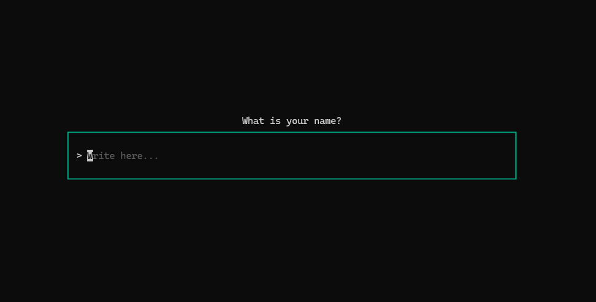

# Q/A in Go

A small question-and-answer app in Go, written with the
[Bubble Tea](https://github.com/charmbracelet/bubbletea/tree/main) and 
[Bubbles](https://github.com/charmbracelet/bubbles) libraries.

# Instructions

1. Ensure you have Go installed on your system
2. Run the app, either with:
   - `go run .` or
   - `make run` if you have Make
3. Quit the app with `crtl+c`

You can even ask your own questions by editing the `questions.go` file.
